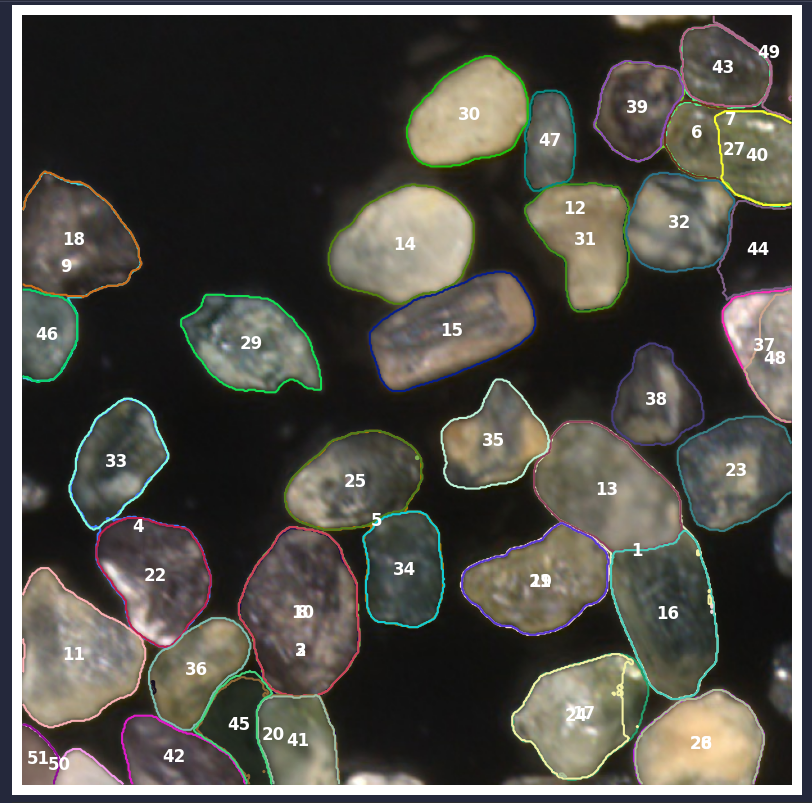

# TP2 Vision artificielle et traitement des images

## Étudiants

-   **Goudal** Victor GOUV07120100
-   **Erard** Julien ERAJ09050200
-   **Flaceliere** Matthieu FLAM30090200

## Introduction

Ce rapport présente notre travail sur le TP2 du cours 8INF804 - Vision artificielle et traitement des images. L'objectif est d'utiliser un algorithme de segmentation sur des images d'échantillons de minéraux afin de les isoler et d'extraire la moyenne sur chaque canal BGR de l'image d'origine.

## Utilisation

### Prérequis

-   Python 3
-   Libs: numpy, matplotlib, cv2, pandas, scikit-image
-   Dossier contenant les images des échantillons sous forme :

```
images/
  Echantillion1Mod2_301.png
  Echantillion1Mod2_302.png
  Echantillion1Mod2_303.png
  Echantillion1Mod2_304.png
  Echantillion1Mod2_305.png
  Echantillion1Mod2_306.png
  Echantillion1Mod2_316.png
  Echantillion1Mod2_422.png
  Echantillion1Mod2_471.png
```

```bash
python3 main.py "PATH_TO_IMAGES"
```

## Utilisation des méthodes de segmentation

### Méthode tester

| Algorithme                                                                                                                                                         | Avantages                                                                                              | Inconvenients                                                                                   |
| ------------------------------------------------------------------------------------------------------------------------------------------------------------------ | ------------------------------------------------------------------------------------------------------ | ----------------------------------------------------------------------------------------------- |
| [Watershed](https://scikit-image.org/docs/0.12.x/auto_examples/segmentation/plot_watershed.html?highlight=segmentation)                                            | Bonne précision pour segmenter des zones connectées, utile pour les contours bien définis              | Sensible au bruit, nécessite un prétraitement soigné                                            |
| [Sobel](https://scikit-image.org/docs/stable/auto_examples/edges/plot_edge_filter.html#sphx-glr-auto-examples-edges-plot-edge-filter-py)                           | Simple et rapide, bon pour détecter les contours et les changements d'intensité dans une image         | Peu efficace pour la segmentation complexe, sensible au bruit                                   |
| [Expand labels](https://scikit-image.org/docs/stable/auto_examples/segmentation/plot_expand_labels.html#sphx-glr-auto-examples-segmentation-plot-expand-labels-py) | Utile pour étendre les labels existants dans les zones voisines, simple pour améliorer les annotations | Ne crée pas de nouvelles segmentations, dépend des labels existants + Inéfficace dans notre cas |

## Description de l'algorithme

Pour segmenter les grains de minéraux, nous avons utilisé la `region-based segmentation`. Cette méthode est adaptée pour bien repérer les limites des grains. Voici les étapes suivies :

1. Prétraitement de l'image

Nous avons appliqué un ajustement de contraste, appelé CLAHE (Contrast Limited Adaptive Histogram Equalization), pour renforcer les contrastes de l'image. Ce procédé améliore la visibilité des contours tout en limitant le bruit. Nous avons fixé un clipLimit de 2.0 et une tileGridSize de (8,8) pour que le contraste soit équilibré.

2. Binarisation et détection des contours

Ensuite, nous avons utilisé une binarisation adaptative pour séparer les pixels clairs et foncés. Cela permet de compenser les variations de lumière dans l'image.

Pour faire ressortir les bords, nous avons appliqué le filtre Sobel, qui détecte les changements d’intensité et fait ressortir les contours des grains.

3. Définition des marqueurs

Nous avons défini des marqueurs de région dans l’image pour distinguer l’avant-plan (les grains) de l’arrière-plan. Ces marqueurs sont nécessaires pour guider l’algorithme de Watershed.

    Marqueur d'avant-plan (valeur 1) : pixels d’intensité élevée (>150).
    Marqueur d’arrière-plan (valeur 2) : pixels d’intensité faible (<30).

4. Segmentation avec Watershed

Nous avons appliqué l’algorithme Watershed pour séparer les régions. Cet algorithme utilise les marqueurs pour isoler chaque grain. Il considère les pixels les plus bas comme des "vallées" et les remplit jusqu’à atteindre les marqueurs. Cela permet de bien délimiter chaque grain. 5. Calcul des moyennes de couleur

Une fois les grains isolés, nous avons extrait leur moyenne de couleur pour chaque canal (B, G, R). Nous avons utilisé findContours d’OpenCV pour localiser chaque contour, puis calculé la moyenne de couleur pour chaque région. Les moyennes BGR de chaque grain sont stockées dans un DataFrame.

## Résultats

## Ouverture (Effectué avant le cours)

Le fichier `segment_anything.py` provient du repository suivant [Segment Anything](https://github.com/facebookresearch/segment-anything)
avec certaines modifications. Il nous a permis de tester la segmentation avec le modèle SAM de Facebook.
Le modèle a été relativement précis avec des paramètres basiques.
Il est sûrement possible d'améliorer les résultats obtenus en modifiant les paramètres.
Nous avons été limités par notre puissance de calcul (environ 2min pour l'image de test).

